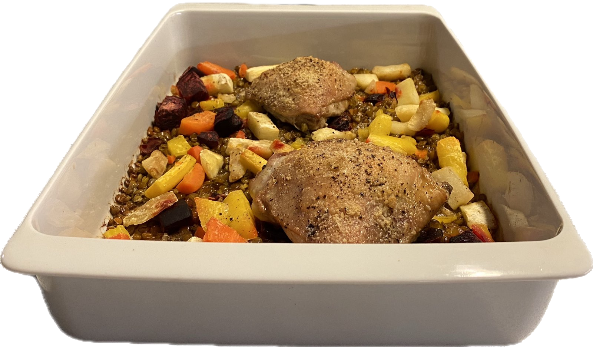

{ width=50% }

**Ingredients:**

- 600 g of frozen root vegetable mix
- 2 dl green lentils
- 50 g of butter
- 800 g of chicken thigh
- 2x10 g (1 L) chicken boullion cubes
- 0.2 L of water
- 15 g of parmesan
- Salt & Pepper

**Steps:**

1. Boil the lentils in plenty of water for 10 minutes.
2. Dissolve the boullion in 0.2 L of water
3. Spread the butter on an oven proof dish and add:
  - The now cooked lentils
  - The dissolved boullion
  - The chicken thigh
  - The frozen vegetables
4. Spread grated parmesan, salt and pepper on the chicken thighs.
5. Cook the dish in the oven for ~40 minutes at 200 degrees celsius.

> View this page [in markdown](./index.md)
