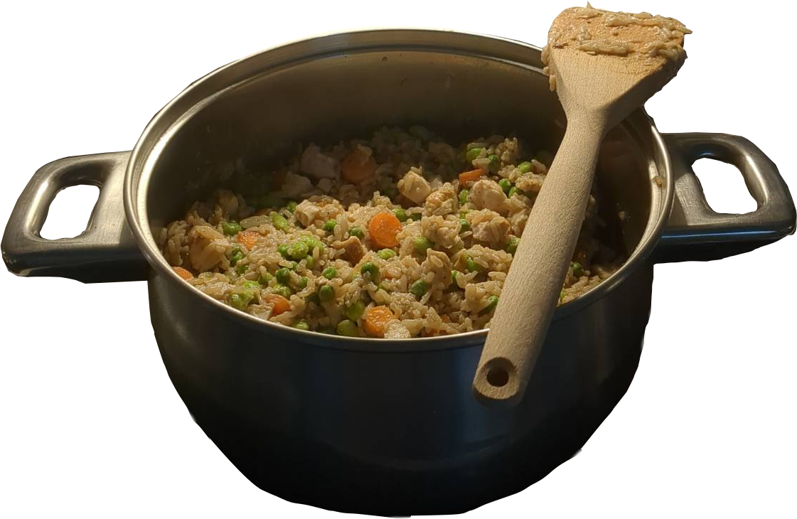

{ width=50% }

**Ingredients:**

- 1 L water
- 300 g fine chopped onions
- 450 g of chicken
- 4x5 g chickenboullion dice (2 L)
- 250 g of frozen peas
- 250 g of frozen edamambeans
- 250 g of carrots
- 350 g brown rice

**Spices:**

- 2 g herbs du province
- 2 g pepper
- 20 ml soy sauce
- optionally, lemon

**Steps:**

1. Brown the chicken breasts whole in a large oven safe pot.
2. Take the chicken out and cut it into bite-sized pieces.
3. Fry the onions then stir in rice when they are browned.
4. Let it sit for a minute, then add water and the chicken boullion.
5. Give it 15 minutes in the oven, then add the carrots. 
6. Give it another 10 minutes in the oven. 
7. Finally add frozen peas and frozen edamambeans and stir.
8. Serve and enjoy, top portions with squized lemon.

> View this page [in markdown](./index.md)
