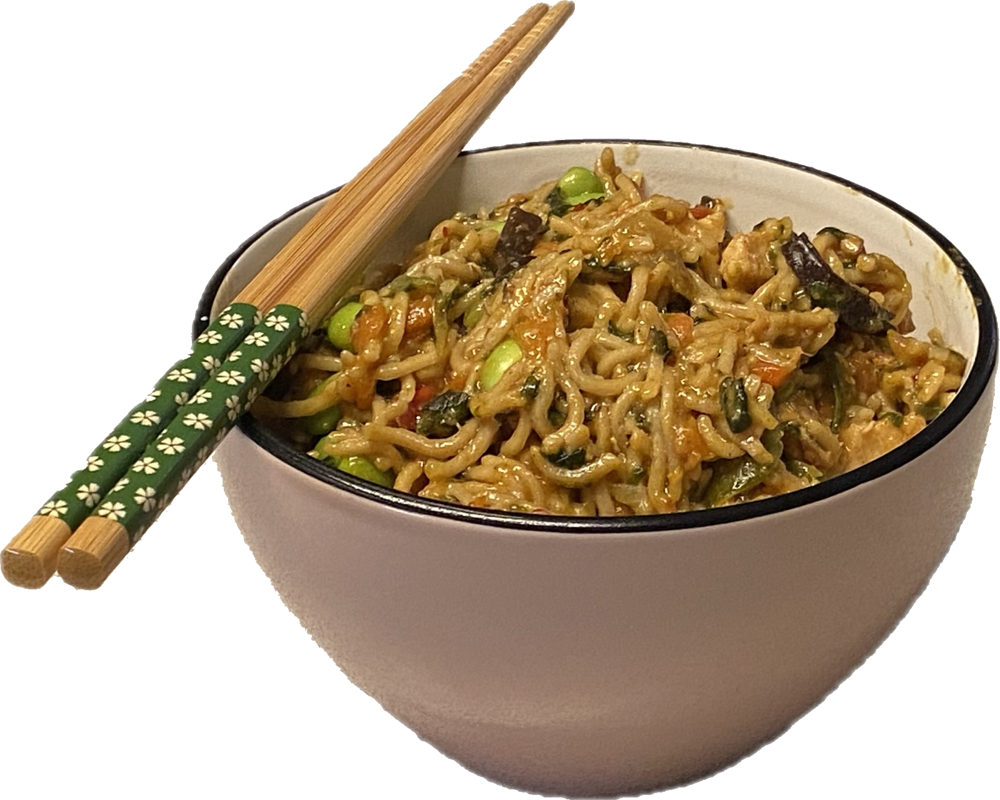

{ width=50% }

I usually fry in butter or olive oil, but you can use whatever fats you
prefer. I also prefer frozen precut garlic for convenience. I personally
don't add salt at the end, and prefer to add a bit more soy sauce if I don't
feel it's salty enough.

**Ingredients:**

- 400 g frozen edamame beans (no shell)
- 800 g frozen wok mix
- 250 g whole grain noodles
- 1 can of coconot milk
- 450 g chicken breast

**Spices:**

- 2x10 g (1 L) chicken bullion cubes
- 30 ml soy sauce
- 50 g red curry paste
- 20 g or 4 cloves of garlic
- Salt & Pepper to taste

**Steps:**

1. Fry the chicken at high heat until both sides have been browned. You do
   not have to fry the meat until it is cooked all the way through.
2. Remove the meat, cut the meat in bite-sized peices
3. Add the vegetable mixes and garlic, fry until the water has boiled out
   of them and they start frying. Then let them fry for a moment.
4. Boil the noodles as per package instructions, then add the boiled noodles
   to the vegetables and let them fry for a bit.
5. Finally, add:
   - Soy sauce
   - Chicken broth cubes
   - Coconut milk
   - Garlic
   - Salt and pepper to taste

> View this page [in markdown](./index.md)
